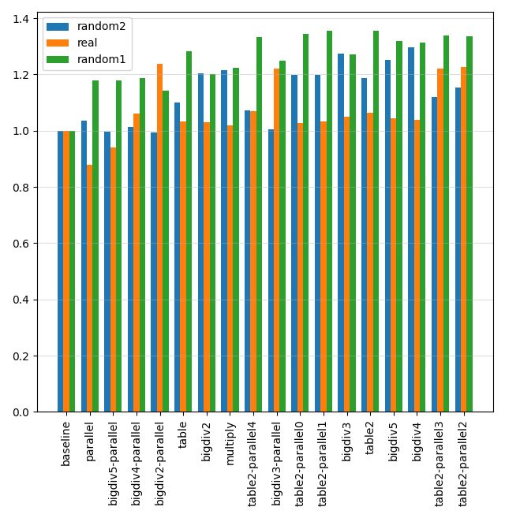

# Computing the number of digits - benchmarks

Ideally, there would be some very clever blogpost that the code in this repository would merely be
accompanying. Unfortunately, I don't blog. On the other hand, I do code. Coding
requires some documentation. Hence, this readme.

It's not that we lack online material about computing the number of digits fast.
On Youtube, you can watch Andrei Alexandrescu discuss this subject, e.g.,
[here](https://www.youtube.com/watch?v=o4-CwDo2zpg).
Daniel Lemire devoted
[this](https://lemire.me/blog/2021/05/28/computing-the-number-of-digits-of-an-integer-quickly)
and then
[this](https://lemire.me/blog/2021/06/03/computing-the-number-of-digits-of-an-integer-even-faster)
blogpost to this topic. Sadly, there are no actual measurements. This code rectifies that.

## Build
No Makefile is provided. Run the script `build.sh` to create the executables.
To create the test data, run the script `prepare_data.sh`. The script `run_tests.sh`
will perform the benchmark tests and write the output to the results directory.

Finally, the script `sanity.sh` will check that every method gives the correct result
for all 32 bit unsigned integers; run this if you're paranoid.


## Methods
Our baseline is the classical, naive implementation:
```
uint32_t num_digs(uint32_t n)
{
    uint32_t r = 1;
    for (;;) {
        if (n < 10) return r;
        n /= 10;
        r++;
    }
}
```

There are various approaches to improving this algorithm. The Lemire blogposts discuss table-base
implementations, e.g.,
```
uint32_t num_digs(uint32_t n)
{
    static uint32_t table[] = {9, 99, 999, 9999, 99999,
        999999, 9999999, 99999999, 999999999};
        int y = (9 * (31 - __builtin_clz(x|1))) >> 5;
        y += x > table[y];
        return y + 1;
}
```

The Alexandrescu-method relies on the observation that actual data in practice
do not follow a uniform distribution: most numbers we deal with are small. Let's call
this method "bigdiv". This code illustrates the concept:
```
uint32_t num_digs(uint32_t n)
{
    uint32_t result = 1;
    for(;;) {
        if (n < 10) return result;
        if (n < 100) return result+1;
        if (n < 1000) return result+2;
        if (n < 10000) return result+3;
        n /= 10000u;
        result += 4;
    }
}
```

My two cents is based on the hope that instruction-level parallelism might turn out to be faster
in practice than either of the two methods above. Let's call this approach
the "parallel" method. Here's the most extreme implementation of this idea:
```
uint32_t num_digs(uint32_t n)
{
    return 1 +
        (n >= 10) +
        (n >= 100) +
        (n >= 1000) +
        (n >= 10000) +
        (n >= 100000) +
        (n >= 1000000) +
        (n >= 10000000) +
        (n >= 100000000) +
        (n >= 1000000000);
}
```

Of course, these methods can be combined in various ways, e.g., like this:
```
uint32_t num_digs(uint32_t n)
{
    uint32_t result = 1;
    for(;;) {
        if (n < 1000) {
            return result + (n >= 10) + (n >= 100);
        }
        n /= 1000u;
        result += 3;
    }
}
```
or this:
```
uint32_t num_digs(uint32_t n)
{
    static const uint64_t table[] = {
        4294967296,  8589934582,  8589934582,  8589934582,  12884901788,
        12884901788, 12884901788, 17179868184, 17179868184, 17179868184,
        21474826480, 21474826480, 21474826480, 21474826480, 25769703776,
        25769703776, 25769703776, 30063771072, 30063771072, 30063771072,
        34349738368, 34349738368, 34349738368, 34349738368, 38554705664,
        38554705664, 38554705664, 41949672960, 41949672960, 41949672960,
        42949672960, 42949672960};
    if (n < 10) {
        return 1;
    }
    return (n + table[31 - __builtin_clz(n)]) >> 32;
}
```

## Data
Three datasets are used. Two of those are randomly generated with different distributions.
The third dataset is extracted from two Github repositories
([this](https://github.com/freeCodeCamp/freeCodeCamp/) and
[this](https://github.com/logpai/loghub)). The idea was to have
something that resembles "real" data; there's no telling if this
attempt actually succeeded.

## Simple microbenchmarks won't cut it
We can't just benchmark the `num_digs` variants in isolation, because
runtimes can vary dramatically depending on how the return
value is used in the calling site. This is  demonstrated by the executables in
directory `simple`. These
programs compute the number of digits for all integers in a given
range. The "add" versions add all the returned values;
the "xor" versions xor them.

Do this after you've run `build.sh`:
```
cd simple && for i in *; do ./${i} 500000 1000000; done
```
On my machine, I get the following results:

| Program | Running time (microseconds)|
| --- | --- |
**parallel-add** | 557
bigdiv5-parallel-add | 675
bigdiv5-add | 854
bigdiv5-xor | 854
table2-add | 974
table2-xor | 974
bigdiv4-add | 1155
bigdiv4-xor | 1164
table-add | 1252
table-xor | 1252
bigdiv3-parallel-add | 1384
bigdiv3-parallel-xor | 1384
bigdiv4-parallel-add | 1385
bigdiv4-parallel-xor | 1385
bigdiv3-add | 1432
bigdiv3-xor | 1432
bigdiv5-parallel-xor | 1568
bigdiv2-add | 1683
bigdiv2-xor | 1683
bigdiv2-parallel-add | 1728
bigdiv2-parallel-xor | 1728
multiply-add | 1750
multiply-xor | 1753
**parallel-xor** | 1966
baseline-xor | 2711
baseline-add | 2718
table2-parallel0-xor | 2997
table2-parallel1-add | 2997
table2-parallel1-xor | 2997
table2-parallel0-add | 3001
table2-parallel2-add | 3003
table2-parallel4-xor | 3005
table2-parallel2-xor | 3007
table2-parallel3-add | 3007
table2-parallel3-xor | 3007
table2-parallel4-add | 3007

The "add" version of parallel beats all the competition, finishing in 557 microseconds.
Its "xor" counterpart performs badly, finishing in about 2000 microseconds.
Thus, the performance of a digit-counting function can massively depend on the context
in which the function is called.

The actual benchmarks in the `progs` directory try to work around this problem
by measuring the performance of the digit-counting function in a
(hopefully) realistic, "itoa"-like context.

## Results
I ran all tests in a Linux laptop (Ubuntu 20.04), with this cpu: `11th Gen Intel(R) Core(TM) i5-1145G7 @ 2.60GHz`
Versions: GCC 9.4.0, CLANG 12.0.1. Other CPUs and compilers will surely yield different results.

Here's a chart that gives a summary of the results; these numbers were obtained by averaging
the results of multiple runs across the gcc and the clang versions and
normalized against the "baseline" implementation.
Greater numbers are better: e.g., 2.0 would mean that the given executable
finished twice as fast as the baseline version on a dataset.


